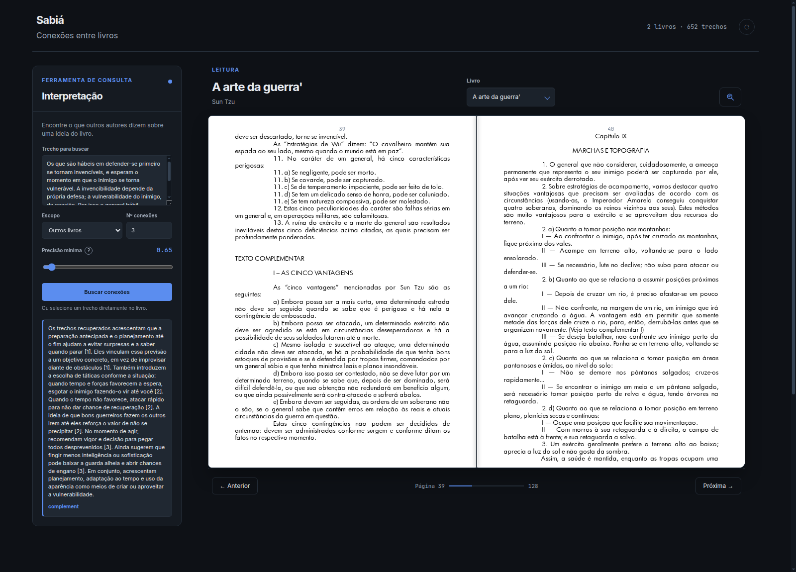
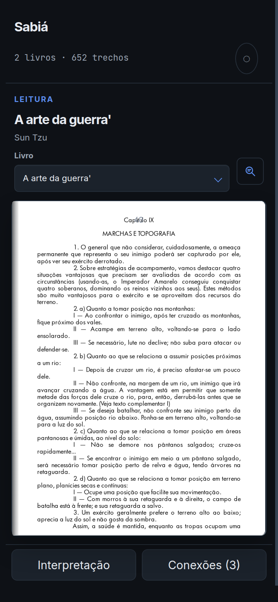

<h1 align="center">Sabiá</h1>

<p align="center">
  O leitor seleciona um trecho de um livro e vê o que <b>outros autores</b> dizem sobre a mesma ideia —<br>
  interpretado, com as fontes e as páginas.
</p>

<p align="center">
  
  
  
  
</p>

<p align="center">
  
  <br>
  <sub>O trecho enviado à esquerda; o card interpretado e as conexões com score; o livro aberto ao lado.</sub>
</p>

## O que é

Quem estuda por conta própria lê um livro de cada vez, e o que fica de cada obra é o que aquele autor disse. Ideias que só fariam sentido juntas — ditas por autores diferentes — ficam separadas pela ordem em que foram lidas, quando não se perdem de vez.

O Sabiá existe para mostrar o encontro, no momento em que ele importaria. Dada uma passagem, ele busca os trechos mais próximos entre as outras obras do acervo e devolve o que eles dizem entre si.

## O que faz

- **Encontra a relação entre autores.** Cada conexão vem classificada: complemento, contradição, nuance ou mesmo conceito.
- **Interpreta a evidência, não o livro.** O card é uma síntese curta do que os trechos recuperados acrescentam — não um resumo da obra.
- **Cita sempre com fonte e página.** As citações são montadas pelo motor: o modelo só indica quais trechos usou, e índice fora da lista é descartado. Fonte inventada é impossível.
- **Deixa o leitor no comando.** Escopo (outras obras ou dentro da própria obra), quantidade de conexões e precisão mínima.
- **Costura tudo por uma linha de aprendizado.** O assunto em estudo, escrito pelo leitor, acompanha cada consulta como contexto.
- **Trabalha sobre o acervo de quem lê.** Os livros são enviados pelo leitor; não há catálogo compartilhado nem sugestão de leitura.

Dois modos, sobre o mesmo acervo:

| modo | como funciona |
| --- | --- |
| **Leitura** | o livro é lido na tela, a partir do próprio arquivo. O leitor seleciona o trecho e o card aparece ao lado, sem interromper a leitura. |
| **Consulta** | o leitor escreve o trecho, ou escolhe um livro e uma página, e recebe o card sem leitura na tela. |

<p align="center">
  
  <br>
  <sub>No celular, uma folha por vez — com a lombada no lugar do vinco entre as duas páginas.</sub>
</p>

## Começando

Precisa de **Python 3.14**, **Node 20+** e um projeto no **Supabase** (Postgres com pgvector, Storage e Auth). Os modelos são o **Gemini** (embeddings) e a **DeepSeek** (interpretação).

```bash
git clone https://github.com/arthurRocha01/sabia.git
cd sabia

python -m venv .venv && .venv/bin/pip install -r requirements-dev.txt
cd web && npm install && cd ..

cp .env.example .env && cp web/.env.example web/.env    # e preencha as chaves
```

O `requirements-dev.txt` traz a função mais o que só serve à bancada (uvicorn, pytest, ruff). O `requirements.txt` é o que vai publicado: o pacote da função tem teto de tamanho na plataforma.

Aplique as migrações e crie a conta do dono — o login é e-mail e senha, e **não há cadastro**:

```bash
.venv/bin/python scripts/migrate.py --status
.venv/bin/python scripts/create_user.py seu@email.com
```

Um comando sobe os dois:

```bash
python scripts/dev.py          # motor em :8000, cliente em :5173 — Ctrl+C derruba tudo
```

## Usando

**Enviar um livro.** No perfil, o PDF com o título e o autor informados à mão — não há leitura automática de metadados. Antes de ingerir, o sistema diz quantos trechos o livro terá e quanto resta da cota do dia. Um livro só entra se a fonte tiver camada de texto, e a busca enxerga apenas livros prontos: uma ingestão interrompida deixa dados invisíveis.

**Consultar.** Escolha o livro, escreva o trecho ou marque uma faixa na própria página, e ajuste os três parâmetros:

| parâmetro | |
| --- | --- |
| **escopo** | conexões com outras obras (exclui o livro aberto) ou paralelos dentro da própria obra — exclusivos entre si |
| **quantidade** | de 1 a 10 conexões, 3 por padrão |
| **precisão** | um limiar de similaridade; existe um piso da instalação e o leitor só sobe a partir dele |
| **texto** | até 120 palavras; o excedente é cortado, e o corte é avisado na tela |

**Ler.** No livro aberto, selecione com o mouse ou marque uma faixa vertical. O card aparece ao lado, e clicar numa citação abre a página citada, no mesmo livro ou em outro.

## Configuração

Tudo vem do `.env` (motor) e do `web/.env` (cliente, variáveis do Vite). Nenhum segredo entra no repositório.

| onde | variáveis |
| --- | --- |
| motor | `GOOGLE_API_KEY`, `DEEPSEEK_API_KEY`, `DATABASE_URL`, `SUPABASE_URL`, `SUPABASE_SECRET_KEY`, `SUPABASE_JWKS_URL` |
| cliente (build) | `VITE_SUPABASE_URL`, `VITE_SUPABASE_PUBLISHABLE_KEY` |
| só para migração | `DIRECT_URL` — conexão de sessão; não entra na função |
| opcionais | `MIN_SCORE_FLOOR`, `ALLOWED_ORIGINS`, `QUOTA_DAILY_TEXTS`, ritmo e lote dos embeddings, `LLM_PROVIDER`, `LLM_MODEL`, `LLM_TIMEOUT` |

Notas que mordem:

- `DATABASE_URL` é a conexão do **pooler em modo transação** (porta 6543), que a função usa; a migração usa `DIRECT_URL` (5432). Nada de `?pgbouncer=true`: o parâmetro é do ecossistema Node e o driver Python o recusa.
- A **chave secret** do Supabase ignora as políticas de acesso por dono. Ela só é usada na verificação e na criação de conta, nunca em consulta do leitor.
- `ALLOWED_ORIGINS` vazio é o padrão e libera apenas a mesma origem — o caso em produção, onde cliente e motor moram no mesmo endereço.
- Piso, cota e ritmo ficam num ponto único de configuração, para serem mudados quando o plano deixar de ser gratuito.

## Estrutura

Cliente em React com pdf.js, motor em FastAPI, Postgres com pgvector, embeddings pelo Gemini e interpretação pela DeepSeek.

    prototype/    design aprovado em HTML/CSS/JS (referência visual; tags view-v1 e view-v2)
    api/          ponto de entrada da função na plataforma (api/index.py)
    engine/       o motor
      core/       configuração e erros tipados — não conhece ninguém
      infra/      o mundo de fora: banco, PDF, embeddings, modelo, arquivos, token
      domain/     as operações: ingerir, buscar, interpretar, manter o acervo
      api/        as rotas, o contrato e os adaptadores
    web/          cliente React
      app/        entrada, rotas, sessão, perfil e precisão (provedores)
      api/        um arquivo por grupo de rotas, tipado pelo contrato
      features/   entrar, perfil, consulta e leitura — cada tela com as suas peças
      ui/         o que duas telas usam: cabeçalho, indicador, dica
      styles/     base, mais um arquivo por tela
    supabase/     migrações do banco, SQL numerado e só para a frente
    scripts/      dev, migrações, conta do dono e verificação real
    tests/        testes do motor, offline por padrão

A regra das camadas do motor é uma só: **a dependência aponta para dentro**. O contrato é público, em `/openapi.json` — é a fonte para o cliente, e `web/api/types.ts` é o espelho escrito à mão dele.

## Testes e verificação

```bash
.venv/bin/python -m pytest -q                    # 130 testes do motor, offline (sem rede e sem chave)
.venv/bin/ruff check .                           # linter
cd web && npx vitest run                         # cliente
.venv/bin/python scripts/verify_api.py           # ponta a ponta, contra banco e modelos reais
```

O `verify_api.py` cria contas de teste, entra como o leitor entraria, exercita todas as rotas e apaga tudo no fim — é o que transforma "configurado" em "verificado". Ele consome cota, então é verificação pontual, não rotina.

## Deploy

Um projeto só, na Vercel: o cliente na raiz e o motor sob `/api`, na mesma região do banco (`gru1`, ao lado do `sa-east-1`). O `vercel.json` descreve as duas coisas, incluindo a *rewrite* que faz as rotas do cliente existirem — sem ela, abrir `/perfil` direto daria 404, porque quem resolve essas rotas é o aplicativo, no navegador.

1. Empurre os commits: um deploy constrói o que está no repositório.
2. Crie o projeto no painel e cadastre as variáveis dos dois grupos acima.
3. O primeiro deploy é a prova do pacote — a *rewrite* é a peça que não se verifica localmente.

## Limites do v1

- **PDF com camada de texto**, e nada além: EPUB, digitalizado e OCR ficam fora. A única leitura fora da camada é a da faixa marcada quando ali não há texto — o recorte é transcrito pela visão.
- **Um dono e um acervo.** A separação por dono existe no banco desde a primeira migração, mas não é usada nesta fase.
- **A ingestão avança com o aplicativo aberto.** A corrente de lotes é movida pela consulta de progresso; fechá-lo não perde nada, e a corrente volta na consulta seguinte.
- **Sem anotações, favoritos, histórico de consultas ou cache** no cliente.
- O arquivo do livro não é editável, mas o livro pode ser removido do acervo e ter título e autor corrigidos.
